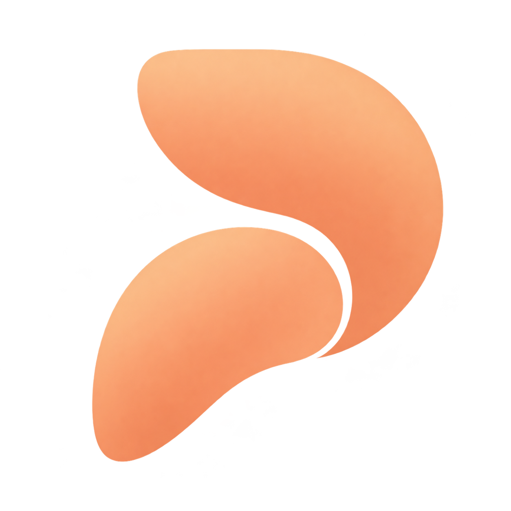
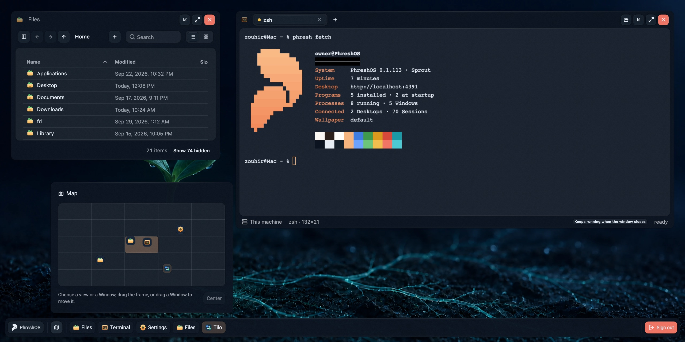
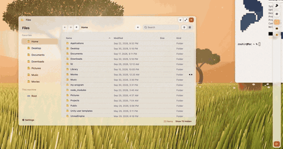

<p align="center">
  
</p>

<h1 align="center">PhreshOS</h1>

<p align="center">
  An open-source, self-hosted system for apps built with web technologies.
</p>

<p align="center">
  <a href="https://phreshos.com">Website</a> ·
  <a href="https://phreshos.com/docs">Documentation</a> ·
  <a href="https://demo.phreshos.com">Live demo</a> ·
  <a href="https://github.com/PhreshOS/system/releases">Releases</a>
</p>



PhreshOS runs on the machine you install it on, keeps your Programs running
there, and gives you a Desktop in the browser to use them from. Programs are
built with the web tools you already know. The System gives each of them a
place to run, one sign-in, communication with other Programs, storage, and
permissions, so a Program only holds its own logic.

Everything on the Desktop, from the file manager to Settings and the
wallpaper, is a Program built on the System, not part of it.

This repository is the **System**: the service that runs on your machine, and
the Desktop it serves.

## What Programs get

- **A place to run.** A Program's Server keeps running on the machine, whether
  or not a browser is open.
- **One sign-in.** The owner signs in to the System. Programs never handle
  accounts, sessions, or connections.
- **Communication.** Programs ask, publish, and listen, between their own parts
  and between Programs, without setting up a transport.
- **Permissions.** The System decides what each Program may reach.
- **Any browser.** Open the Desktop from any browser that can reach the machine,
  and the same Programs are there, as you left them.
- **Agents alongside you.** An AI agent uses the same Programs through the
  `phresh` command line and the SDKs, at the same time as you use them on the
  Desktop.

## Try it

The [live demo](https://demo.phreshos.com) gives you a disposable Desktop for an
hour, with nothing to install.

To install PhreshOS on macOS, Linux, or Windows, you need Node.js 24.15 or
newer:

```sh
npm install --global @phreshos/cli
phresh system install
```

The command installs the System as a service of your user, starts it, and
prints the Desktop's address, usually `http://localhost:4300`. The first visit
creates the owner account. See [Installation](https://phreshos.com/docs/installation)
to update, stop, or remove it, or to change where it keeps its data.

Then create your first Program:

```sh
phresh create my-program
cd my-program
phresh dev
```

## What the System does

The System owns the running state of PhreshOS:

- Programs, their Processes, and the Server and Client Endpoints they run;
- communication between Endpoints, Services, and Programs;
- authentication of the owner and of every connection;
- permissions, storage, uploads, and logs;
- the Desktop: Windows, layers, the plane of views, and the Appearance.

The browser shows this state; it does not hold it. A Desktop, a Node script,
and the `phresh` command all reach the same System, through contracts defined
in [`@phreshos/core`](https://github.com/PhreshOS/core). See
[The System](https://phreshos.com/docs/the-system) for the full model.

<p align="center">
  <a href="https://phreshos.com/media/phreshos-desktop.mp4">
    
  </a>
</p>

## Development

You need [Bun](https://bun.sh) 1.3 and Node.js 24.15 or newer.

```sh
bun install --frozen-lockfile
bun run dev
```

`dev` runs the System from source, with its data in `storage/` in this
repository and the Desktop on the first free port from `5300`. An installed
System uses `~/.phreshos` and ports from `4300`, so both can run side by side.
`PHRESHOS_HOME` and `PHRESHOS_PORT` choose another home or port.

| Command | Does |
| --- | --- |
| `bun run check` | Type-checks the source |
| `bun run build` | Builds the server and the Desktop into `dist/` |
| `bun run test` | Runs the tests in `tests/` |
| `bun run verify` | Runs `check`, `build`, and `test`, including a test that packs the release, installs it in a temporary folder, and boots it |
| `bun run pack` | Builds the release archive and its checksum |

The source has three parts: `source/server` is the System, `source/client` is
the Desktop, and `source/shared` holds what both use.

## Related repositories

| Repository | Role |
| --- | --- |
| [core](https://github.com/PhreshOS/core) | The contracts shared by every part of PhreshOS |
| [client](https://github.com/PhreshOS/client) | The SDK for a Program's Client Endpoint, in its Window |
| [server](https://github.com/PhreshOS/server) | The SDK for a Program's Server Endpoint |
| [node](https://github.com/PhreshOS/node) | The SDK for Node.js code that reaches a running System |
| [react](https://github.com/PhreshOS/react) | React bindings for the SDKs |
| [react-ui](https://github.com/PhreshOS/react-ui) | The component library the Desktop and Programs draw with |
| [cli](https://github.com/PhreshOS/cli) | The `phresh` command: installs the System, builds Programs, and reaches the running System |
| [website](https://github.com/PhreshOS/website) | phreshos.com and its documentation |

## Contributing

See [CONTRIBUTING.md](CONTRIBUTING.md). To report a vulnerability privately,
see [SECURITY.md](SECURITY.md).

## License

[MIT](LICENSE). Copyright © 2026 Zohayr SLILEH.
